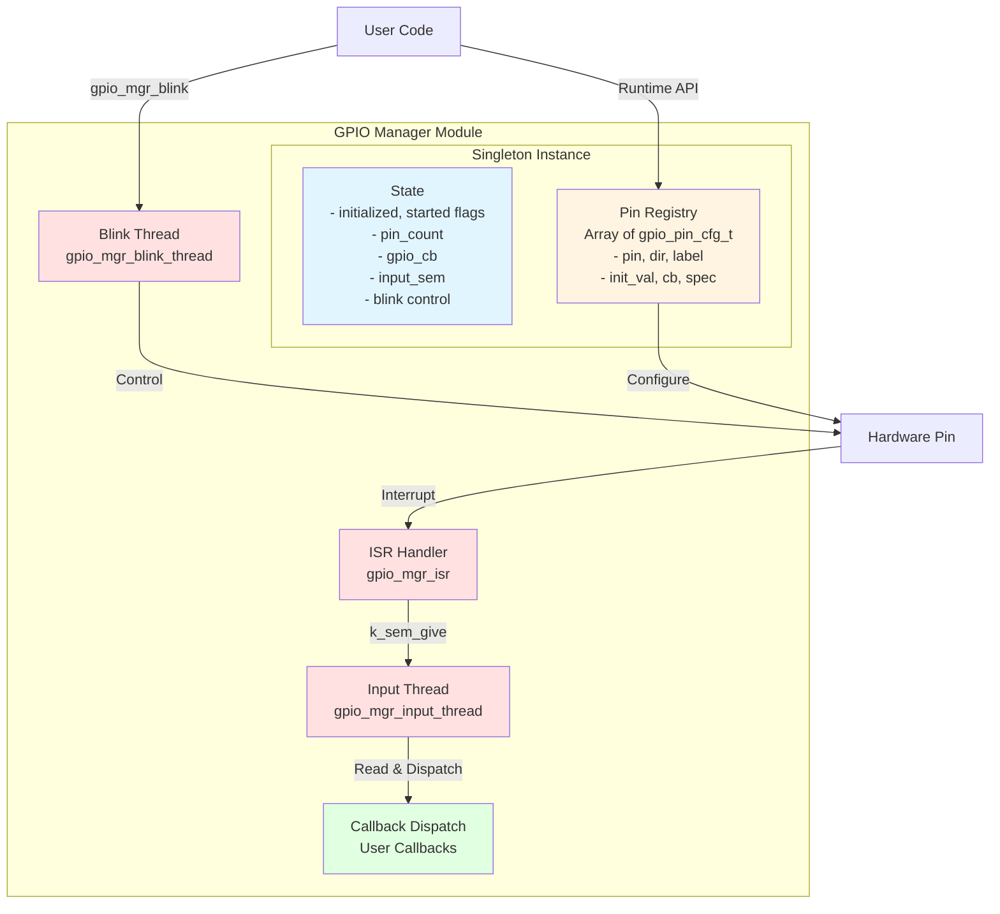
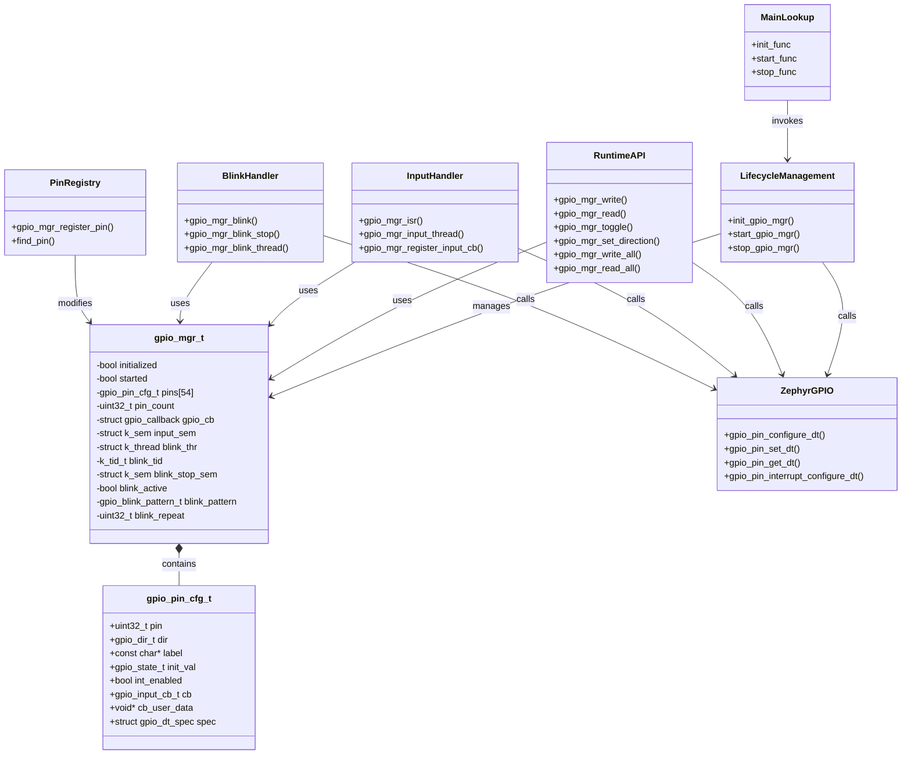
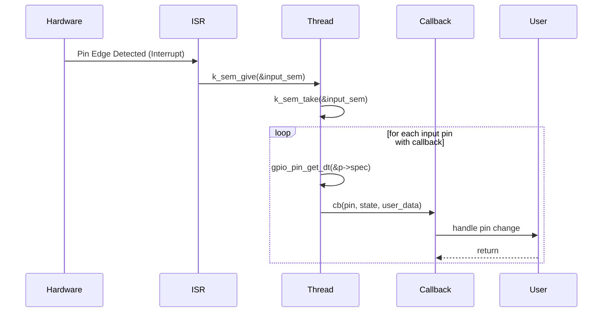
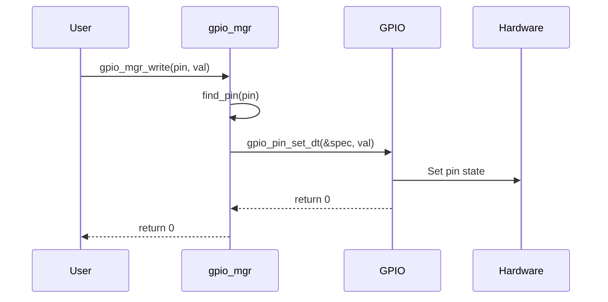
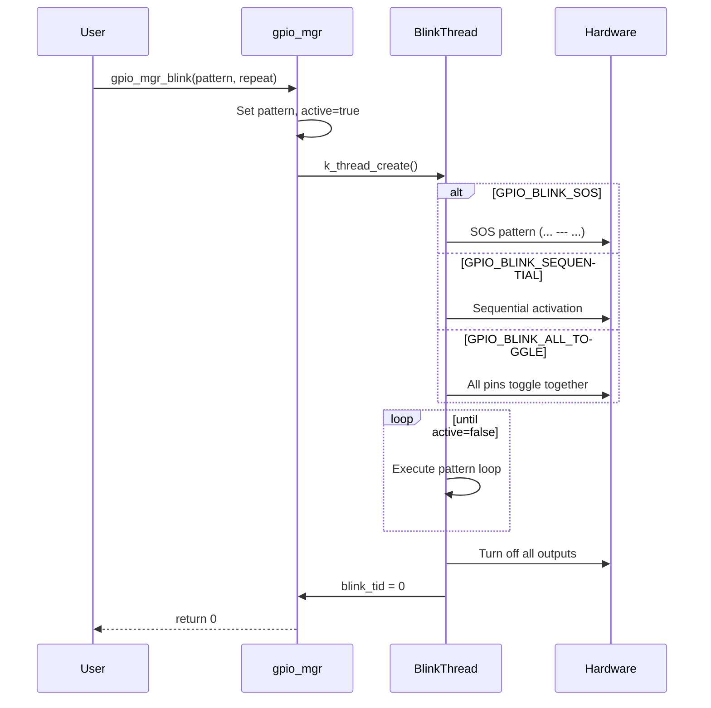
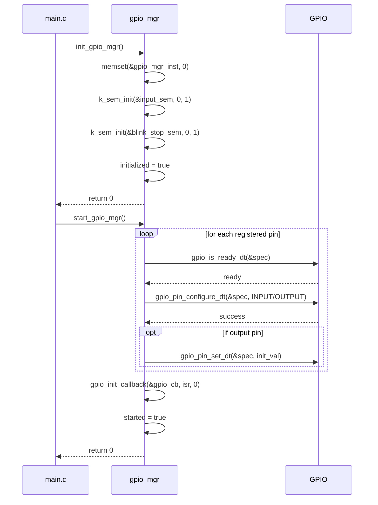
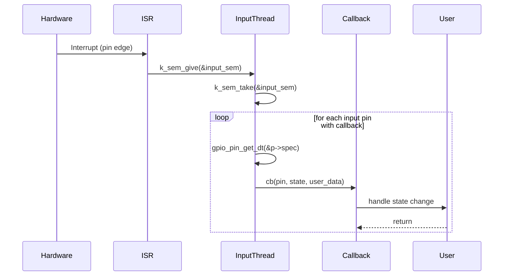
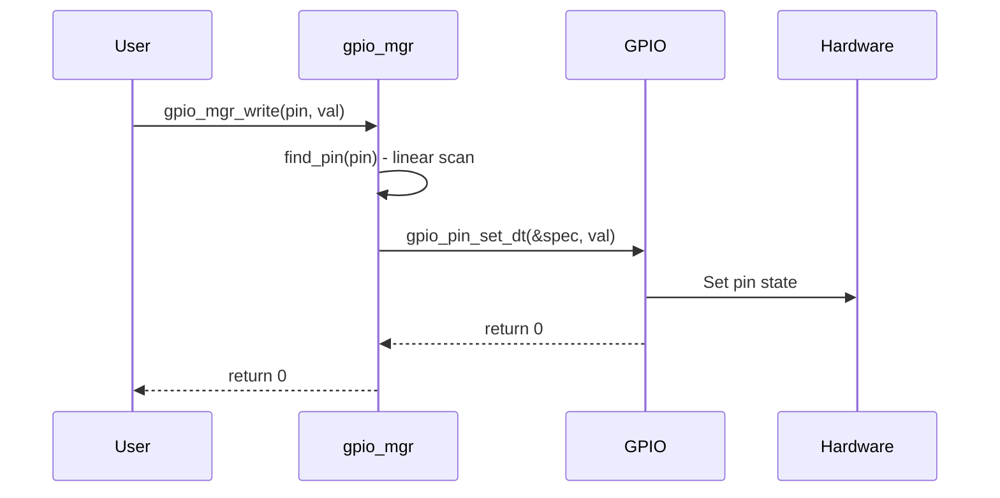
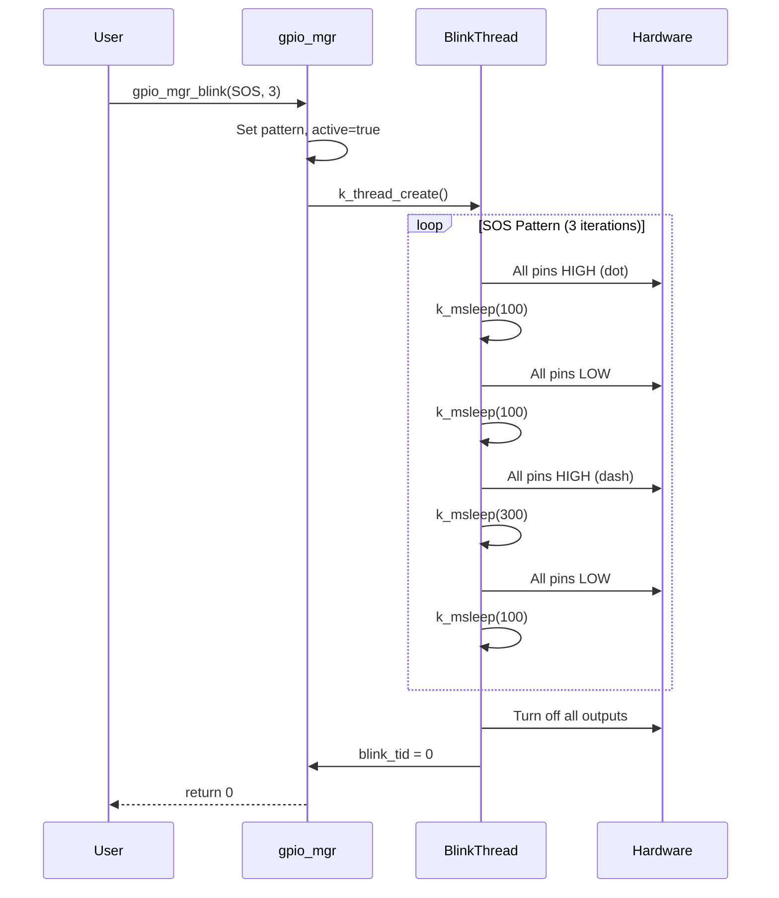
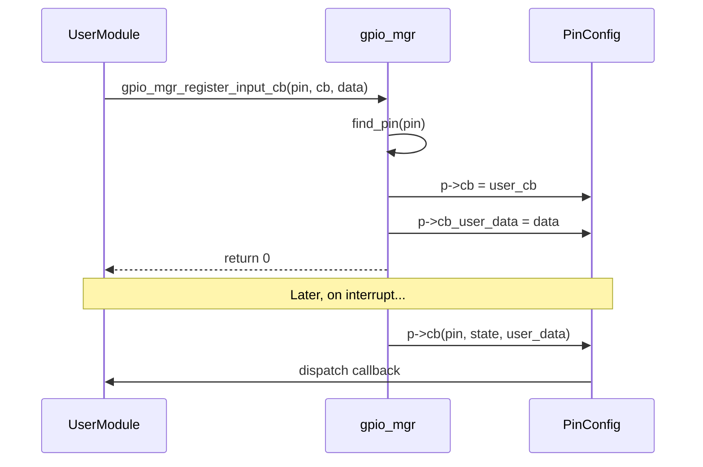

# GPIO Manager Module Analysis

## 1. Architectural Design

### Design Pattern: Singleton + Registry + Event-Driven Architecture

### Core Design Principles

1. **Singleton Pattern**: Single global instance ensures centralized state management
2. **Registry Pattern**: Array-based pin storage with O(n) lookup
3. **Event-Driven**: ISR triggers semaphore, thread processes asynchronously
4. **Devicetree Integration**: Hardware abstraction via Zephyr's DT model
5. **Modular Lifecycle**: init/start/stop functions integrated with main.c LOOKUP pattern

### Key Design Decisions

| Decision | Rationale |
|----------|-----------|
| Singleton instance | Avoid multiple configurations, unified access |
| Single ISR for all pins | Efficient interrupt handling, reduces ISR proliferation |
| Thread-based input processing | ISR stays minimal, processing done in thread context |
| Devicetree pin specs | Platform-independent hardware abstraction |
| Separate blink thread | Non-blocking blink patterns with clean shutdown |

---

## 2. Component Diagram and Data Flow

### Component Diagram

### Data Flow Diagram

#### A. Initialization Flow

#### B. Input Event Data Flow (Interrupt-Driven)

#### C. Output Control Data Flow

#### D. Blink Pattern Data Flow

---

## 3. Sequence Diagram

### A. System Initialization Sequence

### B. Input Interrupt Handling Sequence

### C. Runtime Write Operation Sequence

### D. Blink Operation Sequence

### E. Callback Registration Sequence

---

## 4. Evaluation

### Strengths

1. **Clean Architecture**
   - Clear separation of concerns (lifecycle, registry, input, blink)
   - Singleton pattern prevents misuse and ensures consistency
   - Event-driven design suitable for real-time embedded systems

2. **Zephyr Integration**
   - Uses Zephyr's devicetree for hardware abstraction
   - Leverages Zephyr's GPIO driver API
   - Proper use of Zephyr threading primitives (k_sem, k_thread)
   - Follows Zephyr coding standards

3. **Flexibility**
   - Configurable via devicetree/board overlay
   - Supports both input and output modes
   - Multiple blink patterns
   - Runtime direction change (when stopped)

4. **Robustness**
   - Error handling with proper error codes
   - Guard conditions (already initialized/started)
   - Graceful shutdown of blink thread with join
   - Input validation on all API functions

5. **Portability**
   - Kconfig enables easy inclusion/exclusion
   - Minimal Zephyr-specific code in API layer
   - Could be ported to other RTOS with driver abstraction

### Weaknesses

1. **Linear Search**
   - `find_pin()` is O(n) - could be optimized with hash table or sorted array + binary search
   - For small pin counts (< 10), acceptable but not scalable

2. **Single ISR Limitation**
   - Single ISR for all pins means no per-pin interrupt configuration
   - Cannot specify different trigger types (rising/falling/both)
   - All input pins share same callback mechanism

3. **Thread Safety**
   - No mutex protection for pin registry
   - Assuming single-threaded registration during init
   - Concurrent API calls during runtime may cause race conditions

4. **Limited Input Configuration**
   - No support for pull-up/pull-down resistors
   - No debouncing mechanism
   - Cannot configure edge/level triggers per pin

5. **Blink Implementation**
   - Creates/destroys thread on each blink operation (resource-intensive)
   - No priority inheritance or real-time guarantees
   - Blink patterns are hardcoded (not customizable)

6. **Memory Usage**
   - Fixed array of 54 pins (max) - may waste RAM if fewer pins used
   - Blink thread stack (2048 bytes) allocated even if never used

### Recommendations

1. **Performance Improvements**
   - Implement sorted pin array with binary search for O(log n) lookup
   - Consider bitmap-based pin tracking for faster filtering

2. **Feature Enhancements**
   - Add per-pin interrupt trigger configuration (GPIO_INT_EDGE_RISING, etc.)
   - Implement software debouncing for input pins
   - Add pull-up/pull-down configuration in gpio_pin_cfg_t
   - Support for custom blink patterns via user-provided functions

3. **Robustness**
   - Add mutex for thread-safe registry access
   - Implement reference counting or use-after-free checks
   - Add parameter validation macros

4. **Resource Management**
   - Use static thread allocation with condition variables
   - Implement thread pool for blink operations
   - Make MAX_PINS configurable via Kconfig

5. **Testing**
   - Add unit tests for public API functions
   - Mock GPIO driver for host-based testing
   - Test edge cases (NULL pointers, invalid pins, concurrent access)

### Use Cases

**Ideal For:**
- Simple GPIO control in embedded applications
- LED control and status indication
- Button/switch input with callbacks
- Diagnostic blinking patterns (SOS for error indication)
- Projects requiring unified GPIO abstraction

**Not Ideal For:**
- High-frequency GPIO operations (> 1kHz)
- Applications requiring precise timing
- Projects with > 20 active GPIO pins
- Real-time systems with hard deadlines

### Overall Assessment

The gpio_mgr module is a **well-designed, production-ready GPIO abstraction layer** suitable for most embedded IoT applications. It follows Zephyr best practices, provides a clean API, and handles common use cases effectively. The architecture is extensible, and the event-driven input handling is appropriate for embedded systems. While it has some limitations in scalability and advanced features, it serves its intended purpose well and integrates seamlessly with the larger BSTD application framework.

---

*Analysis based on source files: gpio_mgr.h, gpio_mgr.c, main.c, Kconfig, CMakeLists.txt*